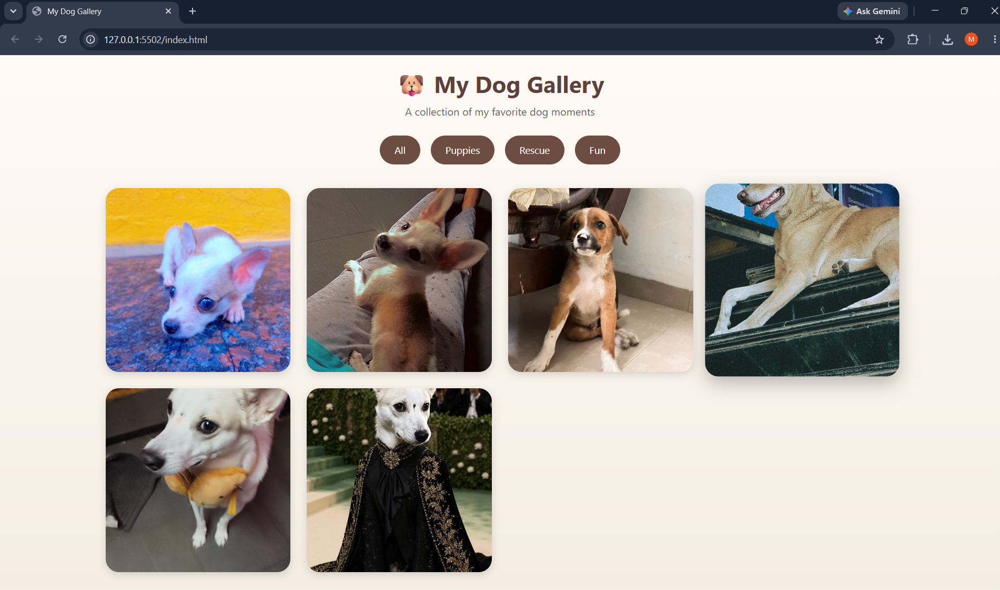

# 🖼️ Image Gallery Project

A responsive image gallery built using HTML, CSS, and JavaScript with lightbox view, navigation buttons, hover effects, and filters.

---

## 🚀 Features
- Responsive grid layout
- Next / Previous navigation
- Lightbox image view
- Hover effects & smooth transitions
- Image categories / filters (bonus)

---

## 🛠️ Tech Stack
- HTML5
- CSS3
- JavaScript

---

## 📸 Preview

---

## 📂 How to Run Locally
1. Download or clone the repository.
2. Open `index.html` in any web browser.
3. Explore the portfolio website.

---

## V.V.K. Mahalakshmi

## License

This project is created for educational and internship purposes.

